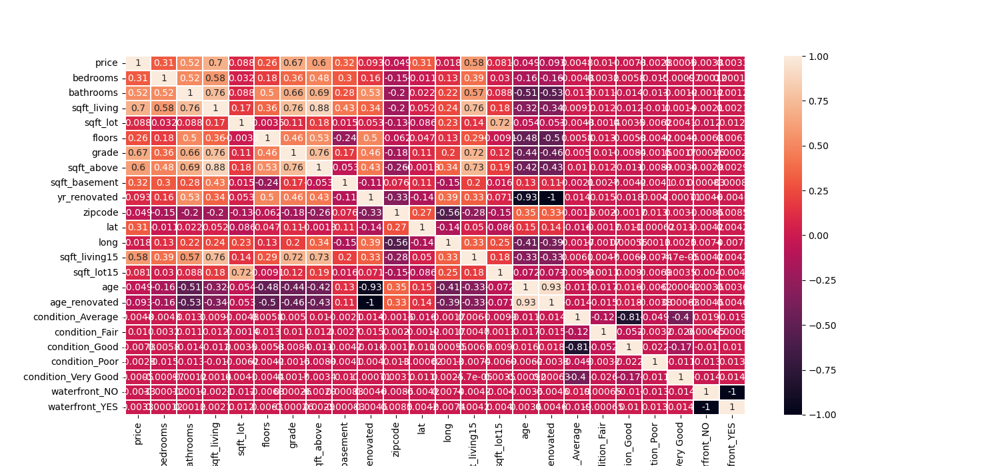
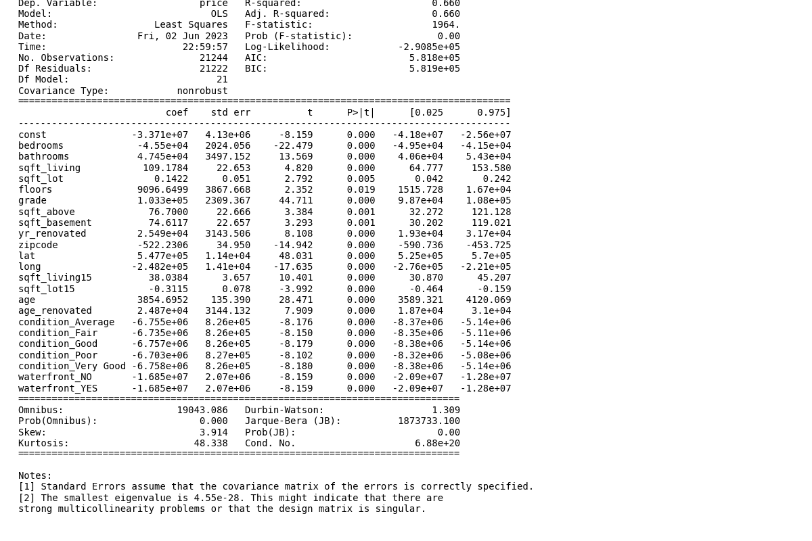
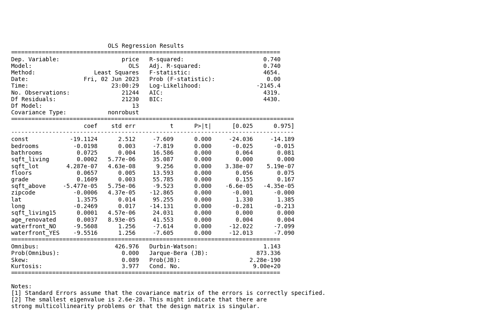

# Multiple Linear Regression

The project aims to help the real estate agencies and  homeowners in making informed decisions about home selling and buying by utilizing the King County House Sales dataset. By analyzing and modeling the dataset, we can determine the influence of various factors on house prices, ultimately providing valuable insights to real estate agencies and homeowners regarding the potential change  in the estimated value of their homes through different  choices.

# OBJECTIVES

To understand which factors determines the price of a home.
To understand how square feet living affect the value of a home.
To explore how condition affect the price of a home.
To explore features which decrease and increase value of the house.

# DATA PREPARATION AND CLEANING
Data was cleaned through the following steps:
1. Checking for missing values where we found that the view, waterfront and year renovated column had missing values. We decided to drop the view column and replace Nans with mode in the waterfront column.
2. Checking for duplicates and outliers
3. Feature engineering using the date column to create a new column named age which shows the age of the house.

# EXPLORATORY DATA ANALYSIS

According to this heatmap, there are some variables which are highly correlated which will be considered in linear regression

# MODELLING

Below is a list of all models built and general description of changes between each model:

### 1. Model 1: Baseline model
Our first model has an adjusted r-squared of .660. All features with p_values that are significant, let's check our residuals.

### 2. Model 2: with log transformed y variables
After log transformation of the dependent variables our residuals are much closer to a normal distribution.

### 3. Model 3: Dealing with Multicollinearity

Conclusion: There are several features that seem to have multicollinearity. Rather than just dropping some of these features, let's first look at the variance inflation factor to understand the severity of the multicollinearity.

### 4. Model 4: Dropping Insignificant Features
Conclusion: Our adjusted R squared still stays the same at .740 and all features are significant. Next, we will further refine our data by removing additional, potential outliers.

### 5. Model 5: Standardizing Features

Interpretation: Since the p-value (0.0024) is less than the significance level (e.g., 0.05), we can reject the null hypothesis. This suggests that there is significant evidence of heteroscedasticity in the data. It implies that the variance of the errors is not constant across the range of the predictors.

In summary,F statistic and p-value, there is evidence of heteroscedasticity in the data, indicating that the assumption of constant error variance may not hold.

# Conclusion

Analyzing the models the following conclusion can be made:
An increase with one bedroom decreases the house sale by $ 0.002.
An increase with one bathroom increases the house price by $ 0.0725.
An increase in Square footage of the home by one square foot increases the price of the house by $ 0.0002.
An increase in Square footage of the by one square feet decreases the house price by $ 4.287e-07.
An increase in floors by one increases price by $0.0657.
An increase in grade rating by one increases the price by $ 0.1609.
An increase in one square foot from basement decrease price by $ -5.477e-05.
An increase in Square footage of interior housing living space for the nearest 15 neighbors by one foot increase prices by $ 0.0001.
There is no significant increase/decrease in the house price with the condition of the house.
Presence of waterfront decreases the house price by $ -9.5516.
